# Arquitetura do ERP Integrado de Segurança Pública e Privada

## Status do documento

Este documento é a especificação arquitetural acumulativa do sistema. O projeto existente já possui `User`, `Weapon` e `Sale`; sua evolução deve ser incremental, com migrações e compatibilidade, sem apagar o código funcional.

Regras permanentes:

- Armamento é apenas um dos módulos do ERP.
- Pessoas, organizações, usuários, licitações, contratos, documentos, workflow, patrimônio e auditoria são núcleos compartilhados.
- Uma pessoa pode assumir qualquer quantidade de papéis simultaneamente ou em períodos diferentes.
- Cada alteração arquitetural deve devolver e atualizar o modelo completo, sem retirar requisitos anteriores.
- Equipamentos possuem atributos comuns, especificações por família e características configuráveis.
- Itens serializados são controlados individualmente; consumíveis podem ser controlados por lote e quantidade.
- Compra, venda, doação, transferência, cautela, consumo e baixa possuem entidades próprias.

## Módulos previstos

1. Núcleo institucional e multi-organização.
2. Pessoas, papéis, usuários, perfis e permissões.
3. Licitações, contratos, compras, recebimentos e financeiro.
4. Patrimônio, estoque, inventário, reservas e cadeia de custódia.
5. Armamentos e materiais controlados.
6. Manutenção, inspeção, validade, certificação e recall.
7. Frota, transporte, expedição e escolta.
8. Planejamento e execução de operações.
9. Inteligência e compartimentação da informação.
10. Incidentes, evidências e investigações.
11. Documentos, workflow, assinatura, auditoria e integrações.
12. Treinamentos, habilitações, riscos, conformidade e notificações.

## Visão geral

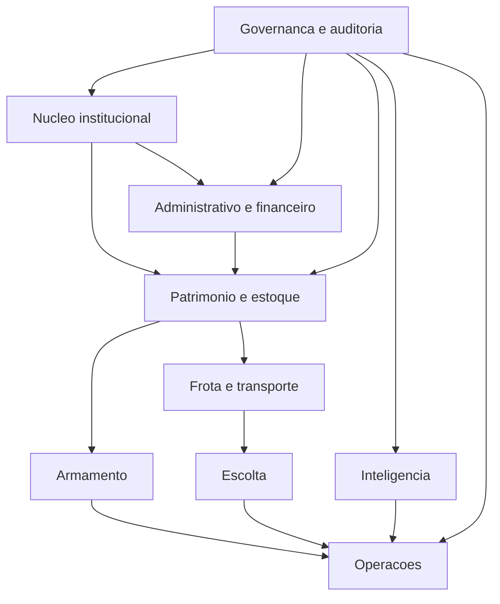

## 1. Núcleo institucional, pessoas e segurança

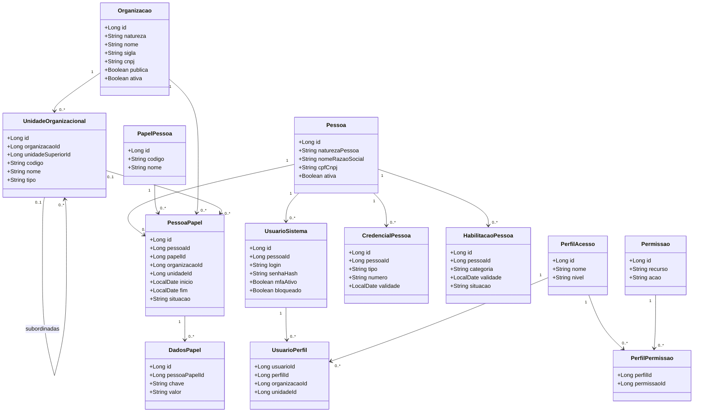

## 2. Licitações, contratos, compras e financeiro

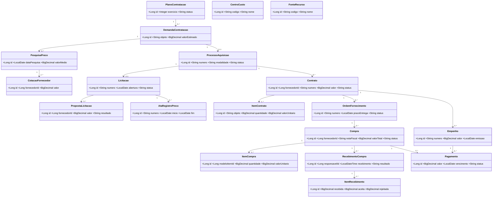

## 3. Patrimônio, estoque e características técnicas

```mermaid
classDiagram
direction TB
class CategoriaItem { +Long id +Long superiorId +String nome +Boolean serializado +Boolean controlaLote +Boolean consumivel }
class Marca { +Long id +String nome +String fabricante }
class ModeloItem { +Long id +String nome +String unidadeMedida +String codigoFabricante }
class CaracteristicaTecnica { +Long id +String nome +String tipoDado +String unidadeMedida }
class CategoriaCaracteristica { +Long id +Boolean obrigatoria +Boolean valorPorUnidade }
class ValorCaracteristicaModelo { +Long id +String valor }
class ItemPatrimonial { +Long id +String codigoPatrimonial +String numeroSerie +String condicaoAtual +LocalDate validade +BigDecimal valorAtual }
class ValorCaracteristicaItem { +Long id +String valor }
class LoteEstoque { +Long id +String numeroLote +BigDecimal quantidadeInicial +BigDecimal quantidadeDisponivel +LocalDate validade }
class ConjuntoItem { +Long id +String codigo +String nome }
class ComponenteConjunto { +Long id +String funcao +BigDecimal quantidade }
class TipoSituacao { +Long id +String codigo +String nome +Boolean terminal }
class HistoricoSituacao { +Long id +LocalDateTime inicio +LocalDateTime fim +String justificativa }
class LocalEstoque { +Long id +String nome +String tipo +Boolean controlado }
class SaldoEstoque { +Long id +BigDecimal disponivel +BigDecimal reservado +BigDecimal bloqueado }
class MovimentacaoEstoque { +Long id +String natureza +BigDecimal quantidade +LocalDateTime dataMovimentacao }
class ReservaItem { +Long id +LocalDateTime inicio +LocalDateTime fim +String finalidade +String status }
class Inventario { +Long id +LocalDateTime abertura +LocalDateTime encerramento +String status }
class ItemInventario { +Long id +BigDecimal quantidadeSistema +BigDecimal quantidadeContada +String resultado }

CategoriaItem "0..1" --> "0..*" CategoriaItem : subcategorias
CategoriaItem "1" --> "0..*" ModeloItem
Marca "1" --> "0..*" ModeloItem
CategoriaItem "1" --> "0..*" CategoriaCaracteristica
CaracteristicaTecnica "1" --> "0..*" CategoriaCaracteristica
ModeloItem "1" --> "0..*" ValorCaracteristicaModelo
CaracteristicaTecnica "1" --> "0..*" ValorCaracteristicaModelo
ModeloItem "1" --> "0..*" ItemPatrimonial
ModeloItem "1" --> "0..*" LoteEstoque
ItemPatrimonial "1" --> "0..*" ValorCaracteristicaItem
CaracteristicaTecnica "1" --> "0..*" ValorCaracteristicaItem
ConjuntoItem "1" --> "1..*" ComponenteConjunto
ItemPatrimonial "0..1" --> "0..*" ComponenteConjunto
LoteEstoque "0..1" --> "0..*" ComponenteConjunto
TipoSituacao "1" --> "0..*" HistoricoSituacao
ItemPatrimonial "0..1" --> "0..*" HistoricoSituacao
LoteEstoque "0..1" --> "0..*" HistoricoSituacao
LocalEstoque "1" --> "0..*" SaldoEstoque
LoteEstoque "1" --> "0..*" SaldoEstoque
ItemPatrimonial "0..1" --> "0..*" MovimentacaoEstoque
LoteEstoque "0..1" --> "0..*" MovimentacaoEstoque
Inventario "1" --> "1..*" ItemInventario
```

## 4. Armamento e materiais controlados

## 5. Operações patrimoniais e manutenção

```mermaid
classDiagram
direction TB
class Venda { +Long id +Long compradorId +BigDecimal valorTotal +String status }
class ItemVenda { +Long id +Long itemId +Long loteId +BigDecimal quantidade +BigDecimal valorUnitario }
class Doacao { +Long id +Long doadorId +Long donatarioId +String termo +String status }
class ItemDoacao { +Long id +Long itemId +Long loteId +BigDecimal quantidade }
class Transferencia { +Long id +Long unidadeOrigemId +Long unidadeDestinoId +LocalDateTime envio +String status }
class ItemTransferencia { +Long id +Long itemId +Long loteId +BigDecimal quantidade }
class ProcessoBaixa { +Long id +String processo +String motivo +String status }
class ItemBaixa { +Long id +Long itemId +Long loteId +BigDecimal quantidade }
class Destruicao { +Long id +String metodo +LocalDateTime dataDestruicao +String certificado }
class PlanoManutencao { +Long id +String tipo +Integer periodicidadeDias }
class OrdemServico { +Long id +Long itemId +LocalDateTime abertura +String status }
class Diagnostico { +Long id +String defeito +String causa +String parecer }
class ServicoExecutado { +Long id +String descricao +BigDecimal custo }
class TesteFuncional { +Long id +LocalDateTime dataTeste +String resultado }
class Vencimento { +Long id +String tipo +LocalDate dataVencimento +String situacao }
class Certificacao { +Long id +String tipo +String numero +LocalDate validade }
class Recall { +Long id +String numero +String motivo +String status }
class ItemRecall { +Long id +Long itemId +Long loteId +String providencia }

Venda "1" --> "1..*" ItemVenda
Doacao "1" --> "1..*" ItemDoacao
Transferencia "1" --> "1..*" ItemTransferencia
ProcessoBaixa "1" --> "1..*" ItemBaixa
ProcessoBaixa "1" --> "0..1" Destruicao
PlanoManutencao "1" --> "0..*" OrdemServico
OrdemServico "1" --> "0..1" Diagnostico
OrdemServico "1" --> "0..*" ServicoExecutado
OrdemServico "1" --> "0..*" TesteFuncional
Recall "1" --> "1..*" ItemRecall
```

## 6. Frota, transporte e escolta

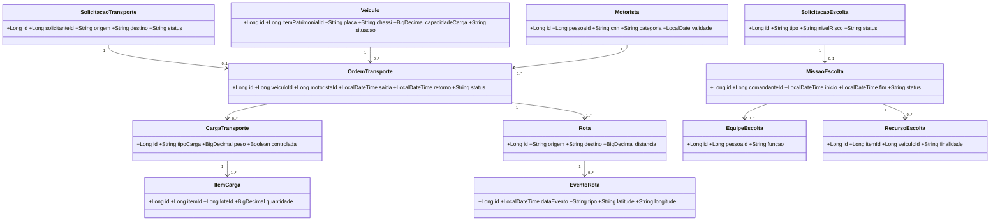

## 7. Operações, inteligência e incidentes

```mermaid
classDiagram
direction TB
class PlanejamentoOperacional { +Long id +String codigo +String objetivo +String classificacao +String status }
class Operacao { +Long id +Long comandanteId +String nome +String tipo +LocalDateTime inicio +String status }
class EquipeOperacional { +Long id +String nome +String funcao }
class MembroEquipe { +Long id +Long pessoaId +String funcao }
class RecursoOperacional { +Long id +Long itemId +Long loteId +BigDecimal quantidade }
class EventoOperacional { +Long id +LocalDateTime dataEvento +String tipo +String descricao }
class CasoInteligencia { +Long id +String codigo +String titulo +String classificacao +String status }
class AlvoInteligencia { +Long id +Long pessoaId +String tipo }
class FonteInformacao { +Long id +String codigoProtegido +String confiabilidade }
class InformeInteligencia { +Long id +String assunto +String classificacao +LocalDateTime recebimento }
class AnaliseInteligencia { +Long id +Long analistaId +String hipotese +String nivelConfianca }
class ProdutoInteligencia { +Long id +String tipo +String titulo +String classificacao }
class CompartimentoAcesso { +Long id +String codigo +String classificacaoMinima }
class AutorizacaoCompartimento { +Long id +Long usuarioId +LocalDateTime inicio +LocalDateTime fim }
class Incidente { +Long id +String protocolo +String tipo +String gravidade +String status }
class PessoaIncidente { +Long id +Long pessoaId +String participacao }
class ItemIncidente { +Long id +Long itemId +Long loteId +String condicao }
class Evidencia { +Long id +String tipo +String descricao +String hash }
class CadeiaCustodiaEvidencia { +Long id +Long entregadorId +Long recebedorId +LocalDateTime transferencia }
class Investigacao { +Long id +Long responsavelId +String resultado }

PlanejamentoOperacional "1" --> "0..*" Operacao
Operacao "1" --> "1..*" EquipeOperacional
EquipeOperacional "1" --> "1..*" MembroEquipe
Operacao "1" --> "0..*" RecursoOperacional
Operacao "1" --> "0..*" EventoOperacional
CasoInteligencia "1" --> "0..*" AlvoInteligencia
CasoInteligencia "1" --> "0..*" InformeInteligencia
FonteInformacao "1" --> "0..*" InformeInteligencia
CasoInteligencia "1" --> "0..*" AnaliseInteligencia
CasoInteligencia "1" --> "0..*" ProdutoInteligencia
CompartimentoAcesso "1" --> "0..*" AutorizacaoCompartimento
Incidente "1" --> "0..*" PessoaIncidente
Incidente "1" --> "0..*" ItemIncidente
Incidente "1" --> "0..*" Evidencia
Evidencia "1" --> "1..*" CadeiaCustodiaEvidencia
Incidente "1" --> "0..*" Investigacao
```

## 8. Workflow, documentos, auditoria e integração

```mermaid
classDiagram
direction TB
class FluxoAprovacao { +Long id +String modulo +String tipoProcesso +Boolean ativo }
class EtapaAprovacao { +Long id +Integer ordem +String papelAprovador +BigDecimal alcada }
class InstanciaFluxo { +Long id +String tipoEntidade +Long entidadeId +String status }
class DecisaoAprovacao { +Long id +Long aprovadorId +String decisao +LocalDateTime dataDecisao }
class Documento { +Long id +String tipo +String numero +String hashArquivo +String classificacao }
class DocumentoEntidade { +Long id +String tipoEntidade +Long entidadeId }
class AssinaturaEletronica { +Long id +Long pessoaId +LocalDateTime dataAssinatura +String hashAssinatura }
class RegistroAuditoria { +Long id +Long usuarioId +String entidade +Long entidadeId +String operacao +LocalDateTime dataOperacao }
class SistemaExterno { +Long id +String nome +String tipo +Boolean ativo }
class EventoIntegracao { +Long id +String operacao +String entidade +Long entidadeId +String status }
class Notificacao { +Long id +Long destinatarioId +String tipo +String mensagem +LocalDateTime envio }

FluxoAprovacao "1" --> "1..*" EtapaAprovacao
FluxoAprovacao "1" --> "0..*" InstanciaFluxo
InstanciaFluxo "1" --> "0..*" DecisaoAprovacao
EtapaAprovacao "1" --> "0..*" DecisaoAprovacao
Documento "1" --> "0..*" DocumentoEntidade
Documento "1" --> "0..*" AssinaturaEletronica
SistemaExterno "1" --> "0..*" EventoIntegracao
```

## Migração das entidades atuais

| Entidade atual | Evolução recomendada |
| --- | --- |
| `User` | Migrar gradualmente para `Pessoa` + `UsuarioSistema`; preservar IDs por tabela de correspondência durante a transição. |
| `Weapon` | Migrar para `ModeloItem` + `ItemPatrimonial` ou `LoteEstoque`, mantendo uma visão/API de compatibilidade enquanto telas antigas existirem. |
| `Sale` | Migrar para `Venda` + `ItemVenda`; separar comprador, itens, valores, documentos e movimentações patrimoniais. |

## Instrução para o Codex

Antes de implementar qualquer módulo, o Codex deverá:

1. Ler integralmente este documento.
2. Inspecionar o código existente.
3. Preservar funcionalidades e dados atuais.
4. Propor migração incremental e reversível.
5. Não substituir requisitos acumulados por versões simplificadas.
6. Atualizar este documento sempre que o modelo mudar.
7. Executar testes e validações antes de concluir alterações.

## Implementation addendum — institutional core (2026-09-10)

This addendum preserves the complete architectural model above. New code, API
contracts, database identifiers, and interface text use English. The Portuguese
concept names in the original diagrams remain the architectural reference.

The user confirmed implementation by module, beginning with the institutional
core. Existing database records are disposable test fixtures; no historical
backfill or legacy ID mapping is implemented in this delivery. Existing User,
Weapon, Sale, and their screens remain available. Their integration with the
new core belongs to the subsequent asset and sales modules.

### Implemented names and relationships

| Architectural concept | Java entity | Table |
| --- | --- | --- |
| Organizacao | Organization | erp_organization |
| UnidadeOrganizacional | OrganizationalUnit | erp_organizational_unit |
| Pessoa | Person | erp_person |
| PapelPessoa | PersonRole | erp_person_role |
| PessoaPapel | PersonRoleAssignment | erp_person_role_assignment |
| DadosPapel | RoleData | erp_role_data |
| UsuarioSistema | SystemUser | erp_system_user |
| PerfilAcesso | AccessProfile | erp_access_profile |
| Permissao | Permission | erp_permission |
| UsuarioPerfil | UserProfile | erp_user_profile |
| PerfilPermissao | ProfilePermission | erp_profile_permission |
| CredencialPessoa | PersonCredential | erp_person_credential |
| HabilitacaoPessoa | PersonQualification | erp_person_qualification |

All entities extend CoreEntity with an identity ID, optimistic-lock version,
createdAt, and updatedAt. Relationship entities also receive their own identity
ID so they can be edited independently. Database foreign keys prevent deletion
of referenced records; no cascade deletion is configured.

Person additionally contains birthDate, address, phone, and email. These preserve
the existing person-registration capabilities in the new model. PersonType uses
INDIVIDUAL and LEGAL_ENTITY. Role assignments use ACTIVE, SUSPENDED, and ENDED;
qualifications use ACTIVE, SUSPENDED, and REVOKED. Organization nature, unit type,
profile level, and credential type remain configurable text fields.

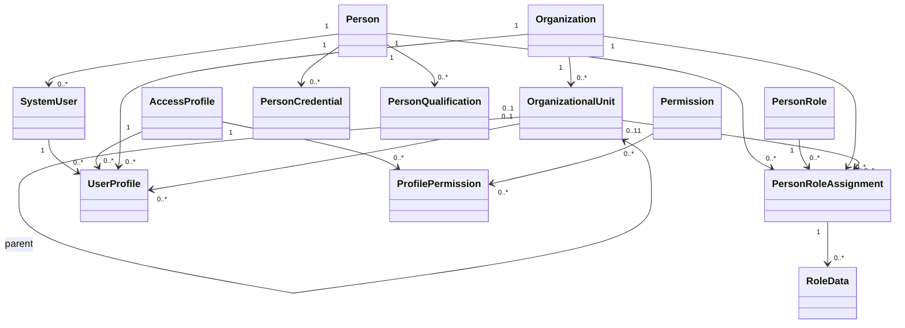

### Application structure and behavior

- `core/model`: JPA entities and relationships.
- `core/service`: transactional persistence, an explicit resource/field allowlist,
  form metadata, password hashing, and cross-record validation.
- `core/controller`: REST endpoints and structured error responses.
- Modules own their layers. Future repositories and standalone DTOs belong in
  `core/repository` and `core/dto`; other modules follow the same convention.
- `/api/erp/core`: the new API; `/erp/core`: the frontend workspace.
- Required fields, invalid choices/dates, cross-organization unit assignments,
  cyclic unit hierarchies, duplicate access assignments, and stale edits are
  rejected. Scope locks serialize hierarchy changes before related rows are read.
- A person can have multiple concurrent or historical roles. Business roles and
  access profiles remain separate entities.
- Passwords are accepted only as input, hashed with BCrypt, and omitted from
  responses. An empty password on update retains the existing hash.
- The frontend offers create, list, search, edit, and delete with confirmation,
  relationship selectors, pagination, and PrimeReact Message feedback.
- The current development `ddl-auto=update` setting creates the new JPA tables
  on API startup. This delivery does not reset or copy the existing database.

### Delivery boundary

This is a functional institutional **registration** module, not an authentication
or authorization implementation. Account blocking, profile levels, permissions,
and organization scope are stored and validated as configuration; they do not
yet enforce access to API requests. MFA enrollment and verification are not
implemented; mfaEnabled remains false and cannot be enabled through these forms.
Full audit records, login/session management, permission enforcement, and
organization-based data visibility remain required by the complete architecture.

The implementation status of asset catalog, serialized assets, lots, stock,
sales integration, and the other modules is continued in the following addenda.
No earlier requirement is removed or replaced by this addendum.

See [Institutional core implementation](institutional-core.md) for the API
contract, development startup, validation commands, and manual verification flow.

## Implementation addendum — asset and inventory foundation (2026-09-10)

The next module implements catalog, technical characteristics, individual assets,
opening stock lots, balances, and opening movements. It depends on the
institutional core and follows the module-first package structure:
`inventory/model`, `inventory/service`, and `inventory/controller`.

### Entity mapping

| Architectural concept | Java entity | Table |
| --- | --- | --- |
| CategoriaItem | ItemCategory | erp_item_category |
| Marca | Brand | erp_brand |
| ModeloItem | ItemModel | erp_item_model |
| CaracteristicaTecnica | TechnicalCharacteristic | erp_technical_characteristic |
| CategoriaCaracteristica | CategoryCharacteristic | erp_category_characteristic |
| ValorCaracteristicaModelo | ModelCharacteristicValue | erp_model_characteristic_value |
| ItemPatrimonial | AssetItem | erp_asset_item |
| ValorCaracteristicaItem | ItemCharacteristicValue | erp_item_characteristic_value |
| LocalEstoque | StockLocation | erp_stock_location |
| LoteEstoque | StockLot | erp_stock_lot |
| SaldoEstoque | StockBalance | erp_stock_balance |
| MovimentacaoEstoque | StockMovement | erp_stock_movement |

All entities inherit identity ID, version, createdAt, and updatedAt from
CoreEntity. Models additionally preserve SKU, description, and commercial listPrice
as distinct catalog attributes. Asset currentValue is separate from listPrice.
Amounts and quantities use BigDecimal with precision 19 and scale 4; the API
returns decimal strings to avoid JavaScript rounding in the registration forms.

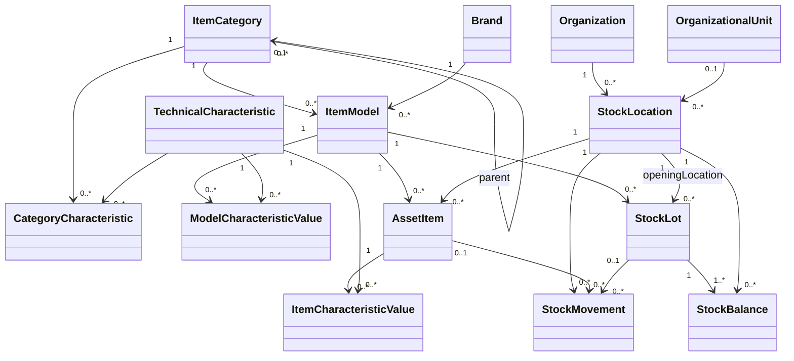

### Implemented rules

- Category trees reject cycles. Tracking flags and family cannot change once a
  category is referenced by a model. Categories classify the families GENERAL,
  FIREARM, AMMUNITION, GRENADE, SPRAY, BALLISTIC_PROTECTION, ELECTRICAL_DEVICE,
  and OPTICAL. Specialized family entities in section 4 remain required.
- Serialized categories require a serialNumber on AssetItem. Asset codes are
  globally unique; serial numbers are unique within a model. Nonserialized,
  nonconsumable models that are not lot controlled can also have individual assets.
- Stock lots require a lot-controlled, nonserialized category and a positive
  initialQuantity. Lot numbers are unique per model and opening location.
- A stock lot creates its initial StockBalance and OPENING StockMovement in one
  transaction. An asset creates a quantity-one OPENING movement. These records
  describe initial registration, not a fabricated purchase or historical receipt.
- Balances and movements are read-only through generic CRUD. Registration fields
  that identify existing stock are immutable. Assets/lots cannot be deleted via
  CRUD; future disposal or reversal operations must handle their lifecycle.
- Asset condition (NEW, GOOD, NEEDS_INSPECTION, DAMAGED) is distinct from the
  availability state (DRAFT, AVAILABLE, BLOCKED, CUSTODIED, SOLD). CUSTODIED and
  SOLD are workflow-controlled. This small state set is
  an implementation stage, not a replacement for TipoSituacao/HistoricoSituacao.
- Characteristics have TEXT, DECIMAL, INTEGER, BOOLEAN, or DATE values. Bindings
  apply to the selected category directly; parent bindings are not implicitly
  inherited. Per-item bindings currently require a serialized category.
- Required model values are checked before a lot is opened or an asset becomes
  AVAILABLE. Assets with required per-item values can first be saved as DRAFT;
  required values must exist before availability is enabled.
- Existing characteristic values prevent incompatible schema changes. Required
  values used by stock cannot be removed through CRUD. A schema change affecting
  existing stock needs a dedicated future evolution workflow.
- Expired assets cannot be marked AVAILABLE, and expired lots cannot be opened
  as available stock. Automatic expiry processing is not implemented yet.
- Locations belong to an organization and optionally a unit in that organization.
  A UnitScopeGuard extension prevents core unit changes from invalidating stock
  location ownership without making the core depend on inventory entity classes.

### Frontend and API

`/erp/inventory` is available from **Assets and inventory** in the sidebar.
`/api/erp/inventory/catalog` describes its forms and their readOnly/createOnly
properties. Each resource provides list/search/detail; registration resources
also provide create/update/delete with validation. Stock history stays read-only.
The frontend shares a module-aware record workspace with the institutional core,
including cross-module organization and unit selectors.

### Remaining work

This delivery is the catalog and opening-stock foundation. It does not implement
stock transfers, reservations, physical inventory reconciliation, purchasing,
custody issuance, consumption, donation, disposal, sale fulfillment, status
history, or the specialized equipment-family tables. Those entities and workflows
remain part of the full model above. The existing Weapon and Sale screens continue
to operate independently until their integration is implemented.

Authentication, permission enforcement, organizational data visibility, and full
audit records remain pending as documented in the institutional-core addendum.
Category row locks currently serialize inventory registration/schema writes;
fine-grained locking can be introduced when transaction workflows are added.
See [Asset and inventory implementation](inventory.md) for verification details.

## Implementation addendum — inventory sales (2026-09-10)

This stage implements Venda and ItemVenda as `sales/model/InventorySale` and
`sales/model/InventorySaleItem`, stored in `erp_sale` and `erp_sale_item`.
The distinct Java entity names avoid collisions with the legacy Sale/SaleItem.
The module also owns `sales/dto`, `sales/service`, and `sales/controller`.
Legacy sales remain available; new ERP sales use the core and inventory records.

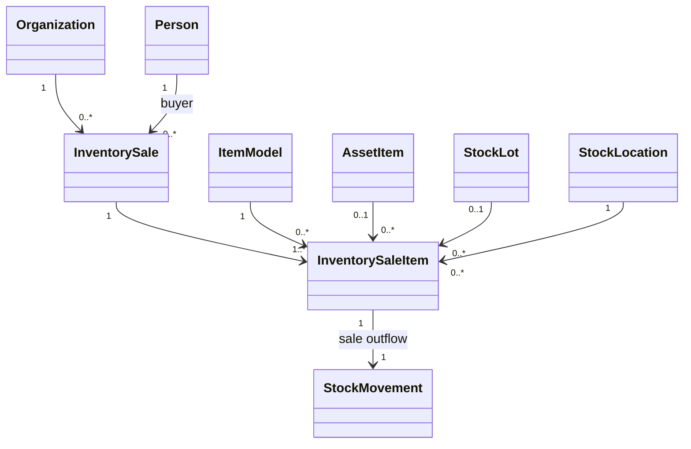

### Transaction rules

- Finalization requires an active organization, an active Person buyer, a payment
  method, and 1–100 distinct stock selections from that organization.
- Each line selects exactly one individual asset or one lot balance at a location.
  Individual assets require quantity one and AVAILABLE status. Lot quantities
  must be positive and cannot exceed the location balance or lot availability.
  Expired stock is excluded from selection and rejected again at finalization.
- Unit prices come from ItemModel.listPrice. The client sends the price it saw;
  a changed price causes a conflict instead of silently charging another price.
  Quantities and prices use decimal arithmetic. Each subtotal is rounded HALF_UP
  to four decimal places and the backend sums the rounded subtotals.
- The sale snapshots buyer/organization names and each line's model name, SKU,
  stock code, location name, unit of measure, quantity, price and subtotal.
  Subsequent registration edits do not change those historical values.
- Finalization, SOLD asset state, balance/lot deduction and negative SALE movements
  commit together. A failure rolls back the complete transaction. Each line has
  a unique reference to its corresponding stock movement.
- Sales use the same category lock order as inventory registration, followed by
  organization and affected record locks. This coarse locking protects stock and
  catalog prices against simultaneous registration and sales writes.
- A unique UUID requestId and a payload fingerprint make identical retries return
  the existing sale. Reusing an ID with different contents returns a conflict.
- Finalized sales expose only read operations. SOLD is workflow controlled;
  generic asset registration cannot set this state or change a sold asset.
  Reversal, returns, cancellation and reimbursement require future workflows.

### Application surface and remaining scope

`/api/erp/sales` provides finalization, organization-filtered history, sale detail,
and paginated available-stock search. `/erp/sales`, linked as **Inventory sales**,
provides buyer selection, asset/lot selection, quantities, required payment method,
totals, finalization and receipts/history. **+ Sale** remounts an empty form.
An uncertain network result keeps the same request for a safe retry on that page.

This implements immediate stock fulfillment for sales, advancing the preceding
inventory foundation. The original `/api/sales` and `/sales/new-sale` remain
independent compatibility flows; they do not deduct ERP stock. No fictional
operator identity is inferred from the buyer. Authentication/authorization,
operator attribution, full audit, approval/compliance rules, document issuance,
payments/reconciliation, returns and the other planned modules remain required.
The API's organization filter is not an authorization boundary.

See [Inventory sales implementation](sales.md) for contracts and verification.

## Implementation addendum — authentication foundation (2026-09-10)

The `security` module now authenticates existing SystemUser accounts, using their
BCrypt password hashes and Person association. It owns configuration, services
and controllers; it introduces no replacement account entity. Legacy User records
remain distinct registration records and are not implicitly granted access.

- `/login` provides the frontend sign-in flow. The sidebar displays the real
  account identity and invokes session logout instead of only navigating home.
- `/api/auth/session`, `/api/auth/csrf`, `/api/auth/login`, and `/api/auth/logout`
  expose session state, CSRF tokens and authentication operations.
- Login rotates the session ID; logout invalidates it. Session cookies are
  HttpOnly and SameSite=Lax with a configured 30-minute inactivity timeout.
- The backend checks blocked accounts, inactive people, removed accounts and
  changed SystemUser versions on authenticated requests. Account changes through
  core CRUD invalidate existing sessions. MFA-enabled accounts are rejected until
  a complete MFA challenge flow exists.
- CORS is centralized across new and legacy APIs using `erp.allowed-origin`.
  Credentialed browser calls are allowed only from the configured frontend origin.
  Authentication mutations always require CSRF; business mutations also require
  CSRF when login enforcement is enabled.
- `ERP_REQUIRE_LOGIN=true` enforces authentication on business API routes and
  frontend pages. It defaults to false for initial account provisioning and
  compatibility with the development workflow. The frontend identifies setup
  mode explicitly. No default credentials or administrator are created.

This advances login/session management while preserving the entire remaining
security architecture. Authentication is not authorization: all authenticated
accounts can currently use the business APIs when enforcement is enabled.
Permission/profile checks, administrative boundaries, organization/unit data
visibility, login throttling, password recovery, MFA, audit and distributed
sessions remain pending. Existing appendices describe earlier delivery boundaries;
this addendum records the current authentication status without removing them.

See [Authentication implementation](authentication.md) for provisioning,
configuration, contracts, verification and remaining limitations.

## Implementation addendum — permissions and scope (2026-09-11)

`security/service/AccessPolicy` now evaluates the existing Permission,
ProfilePermission, AccessProfile and UserProfile relationships. No entity or
earlier requirement is removed. No administrator or permission is auto-created.

- `ERP_ENFORCE_PERMISSIONS=true` enables deny-by-default authorization and
  requires `ERP_REQUIRE_LOGIN=true`. Both remain configurable for initial setup.
- Profile levels SYSTEM, ORGANIZATION and UNIT define global, organization-wide
  and exact-unit grants respectively. SYSTEM and ORGANIZATION require an empty
  assignment unit; UNIT requires a unit. Unknown levels/malformed scopes do not
  grant access. Assignment organizations must be active.
- Exact resource keys and READ/CREATE/UPDATE/DELETE actions control operations;
  the complete `*` value is an explicit wildcard. Administrative user/profile/
  permission resources require SYSTEM `security/access` + MANAGE. Ordinary CRUD
  grants on those resources cannot confer access-administration privileges.
- Scoped predicates filter rows and counts before pagination. Record operations
  validate actual ownership; updates check old and new scope and writes check
  referenced-record READ access. Organization filters cannot widen authorization.
- Shared people, credentials, qualifications, role definitions and model catalog
  remain global resources requiring SYSTEM grants. This is explicit shared-data
  access, not automatic isolation of records without organization ownership.
- Sales require SYSTEM or ORGANIZATION grants. UNIT sales grants are rejected
  until receipt-level unit visibility is defined. Legacy APIs require explicit
  global legacy resource grants because their records lack ERP ownership fields.
- Revocation applies to subsequent requests without a new login. Frontend session
  data exposes effective grants; resource catalogs expose allowed actions and
  omit unreadable resources. Sales controls use the selected organization.

This advances permission enforcement and owned-record visibility beyond the
authentication foundation. Per-unit sales, shared-record ownership policy,
delegated administration, last-administrator safeguards, full audit, operator
attribution, throttling, MFA and recovery remain required future work.

See [Authorization implementation](authorization.md) for the complete resource
matrix, first-administrator setup, operator examples and verification.

## Implementation addendum — business audit and sale operator (2026-09-11)

RegistroAuditoria is implemented as `audit/model/AuditRecord` in
`erp_audit_record`, with module-owned services/controllers. Events contain UTC
time, actor snapshot, resource/record ID, operation and before/after snapshots.
They are immutable application records with no edit/delete API; unlike mutable
CoreEntity records they have no update/version lifecycle.

- Core and inventory CREATE/UPDATE/DELETE operations record server-produced
  snapshots in the same transaction as the mutation. Successful sale finalization
  records the receipt plus asset/balance/lot stock changes as one FINALIZE event.
- Failures roll back both business data and audit events. Idempotent sale retries
  do not duplicate events. Registration-generated OPENING records remain linked
  through the parent resource and inventory history rather than separate events.
- Actor identity comes from the session. No-login setup changes are explicitly
  UNAUTHENTICATED. Actor and target identifiers are historical scalar snapshots
  without cascade/foreign-key dependence, preserving history after deletion.
- Passwords/hashes and named token fields are omitted. A boolean indicates a
  password assignment/change without recording its contents.
- InventorySale adds nullable finalizedById/finalizedByLogin snapshots, exposed
  on the receipt. Earlier sales are preserved with unknown operator information.
- `/api/erp/audit` provides filtered, paginated summaries and event detail.
  `/erp/audit` provides the read-only interface. When authorization is enabled,
  SYSTEM `audit` READ is required; narrower grants cannot expose global history.

This is the successful-business-change portion of the full audit architecture.
Legacy operations, authentication/security failures, read-access logging, direct
database/import changes, tamper-evident retention, archival/export and scoped
history access remain pending. No earlier audit/security requirement is removed.

See [Audit implementation](audit.md) for event semantics, API, verification and
delivery boundaries.

## Implementation addendum — sales by organizational unit (2026-09-11)

InventorySale now optionally belongs to an OrganizationalUnit within its existing
Organization. `erp_sale.unit_id` is a nullable foreign key and `unit_name` is a
historical snapshot. The development schema update adds these columns on restart;
earlier receipts remain organization-wide without inferred or backfilled units.

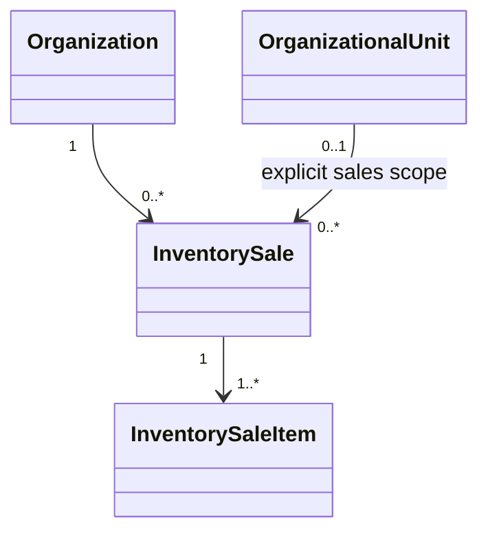

- Stock/history queries and finalization accept optional `unitId`. Selecting a
  unit restricts every stock location and the entire receipt to that exact unit.
  Unit-less locations, sibling units and child units are not included.
- SYSTEM/ORGANIZATION grants retain organization-wide access. UNIT sales READ
  and CREATE now authorize only the explicitly selected/stored matching unit.
  Direct receipt IDs and retries validate historical receipt ownership. A missing
  unit never lets a UNIT grant access an organization-wide sale.
- Organization-wide history includes all organization receipts; unit-filtered
  history includes only receipts explicitly created for that unit. Earlier sales
  remain accessible through their existing organization permissions.
- Unit membership and stock scope are validated in the sale transaction before
  stock details are used. Failures roll back the receipt, outflows and audit.
  The unit participates in idempotency fingerprints; old unit-less fingerprints
  are preserved for compatibility.
- A sales UnitScopeGuard prevents moving a referenced unit to another organization.
  Unit renaming does not alter historical receipt/audit snapshots. The core remains
  independent of sales entity classes through its existing extension interface.
- The frontend selects organization/unit, refreshes scoped stock/history and
  clears the cart when scope changes. Receipts and audit include the unit snapshot.
  Buyer and organization selectors retain their separate READ requirements;
  unit selection additionally requires core/units READ in the appropriate scope.

This completes the per-unit sales visibility deferred by the permissions addendum.
It does not replace any prior module or requirement. Shared-record ownership,
delegated administration, broader security/audit coverage, inventory transfers,
reservations and the remaining workflows continue to require implementation.
See [Sales](sales.md) and [Authorization](authorization.md) for current contracts.

## Implementation addendum — firearm specifications (2026-09-11)

`FirearmSpecification` implements the first dedicated controlled-equipment model
from section 4. It is stored in `erp_firearm_specification` and has a required,
unique one-to-one relationship with ItemModel. The implementation records caliber,
operating mechanism, positive capacity and positive barrel length in millimeters.

- Only models whose direct category family is FIREARM accept this specification.
- One model accepts at most one firearm specification. The relationship is fixed
  after creation; category and unit-of-measure changes are blocked while it exists.
- The resource `inventory/firearm-specifications` uses shared catalog SYSTEM scope,
  generic inventory CRUD, optimistic locking and transactional audit snapshots.
- The inventory workspace generates the English registration form from catalog
  metadata. A new positive-integer field type represents capacity without decimal
  coercion; barrel length retains four-decimal precision.
- Existing configurable characteristics remain available for additional fields.
  Dedicated ammunition, grenade, spray, ballistic protection, electrical device
  and optical specification entities remain subsequent controlled-equipment work.

This addition preserves the generic inventory model and all prior functionality.
See [Inventory](inventory.md) and [User manual](user-manual.md).

## Implementation addendum — firearm regulatory control (2026-09-11)

`RegulatoryControl` implements ControleRegulatorio for individual firearm assets
in `erp_regulatory_control`. It records the external system, official registration
number, status and optional validity date while retaining the asset relationship.

- Only AssetItem records whose model category family is FIREARM are accepted.
- Each asset has at most one registration per external system. Each external
  system/registration-number pair identifies at most one asset.
- Asset and external system are fixed after creation. Status values are PENDING,
  ACTIVE, SUSPENDED, CANCELLED and EXPIRED. A past validity cannot remain ACTIVE;
  sold assets reject registration creation and changes.
- Permission resource `inventory/regulatory-controls` supports SYSTEM,
  ORGANIZATION and UNIT. Ownership is derived from the asset's current location,
  so list predicates, direct IDs, writes and organization filters share the same
  scope boundary. Referencing the asset also requires inventory/assets READ.
- The inventory metadata supplies the English CRUD interface. Mutations use
  optimistic locking and transactional audit snapshots. Existing assets and
  legacy Weapon records are not backfilled or changed.

The external system remains a captured identifier in this stage. The complete
SistemaExterno integration catalog, synchronization, documents and automated
status verification remain future work. See [Inventory](inventory.md) and the
[User manual](user-manual.md).

## Implementation addendum — firearm custody (2026-09-11)

Cautela and ItemCautela are implemented for individual firearm assets through the
module-owned `Custody`, `CustodyItem`, `CustodyReturn`, and `CustodyReturnItem`
entities. The return entities preserve every partial return and stock movement.

- Issue requires active organization, recipient and authorizer, a purpose and
  1–100 distinct AVAILABLE, unexpired FIREARM assets in the exact organization/
  optional unit. It snapshots names/locations, sets assets to CUSTODIED and creates
  negative CUSTODY_ISSUE movements atomically.
- Return creates positive CUSTODY_RETURN movements and restores valid assets to
  AVAILABLE; expired assets become BLOCKED. Custody progresses through ACTIVE,
  PARTIALLY_RETURNED and RETURNED with completion and operator history.
- UUID fingerprints make issue and return retries idempotent. Ordered locks prevent
  simultaneous issue of one firearm; failures roll back records, states, movements
  and audit events.
- `custodies` READ, CREATE and RETURN permissions support SYSTEM, ORGANIZATION and
  exact UNIT scope. Direct records, stock and history enforce stored ownership.
  A UnitScopeGuard prevents invalid organization changes after issue.
- `/erp/custody` provides English issue, firearm search, history and individual or
  all-pending return controls. Inventory CRUD cannot enter or leave CUSTODIED.

This stage covers serialized firearm assets. Ammunition lots, kits, return
inspection, signed documents, overdue notifications and approvals remain future
extensions. Existing sales and legacy flows remain intact. See [Firearm custody](custody.md)
and the [User manual](user-manual.md).
# Incremental implementation appendix: ammunition consumption

The architecture now includes the incremental ammunition consumption module under the `ammunition-consumptions` access resource. It implements `ConsumoDeflagracao` and `ItemConsumo` as `AmmunitionConsumption` and `AmmunitionConsumptionItem`, preserving the responsible person, authorizer, date, status, lot, quantity and result required by this specification.

Finalization is atomic and immutable: it validates organizational scope and ammunition classification, locks balances and lots, deducts both available quantities, creates one negative `AMMUNITION_CONSUMPTION` movement per item and records the operator and audit evidence. A canonical request UUID makes retries idempotent. Existing entities, routes and records remain additive and unchanged.

## Implementation addendum — ammunition specifications (2026-09-11)

`AmmunitionSpecification` implements `EspecificacaoMunicao` in `erp_ammunition_specification`. It has a required, unique one-to-one relationship with `ItemModel` and records caliber, lethality classification, projectile type, case type and primer type. Lethality is independent from caliber, so `12 GA` can identify distinct `LETHAL` and `LESS_LETHAL` models.

- Only models in the `AMMUNITION` family accept the specification.
- A model accepts at most one ammunition specification.
- Model category and unit of measure cannot change while the specification exists.
- `inventory/ammunition-specifications` uses shared catalog SYSTEM scope, generic inventory CRUD, optimistic locking and transactional audit snapshots.
- The inventory metadata exposes the complete English registration form without a separate frontend route.

This addition preserves existing models, lots, consumption history and legacy entities. All dedicated controlled-equipment specification entities listed in section 4 are now implemented.

## Implementation addendum — grenade specifications (2026-09-11)

`GrenadeSpecification` implements `EspecificacaoGranada` in `erp_grenade_specification`, with a unique model relationship, grenade type, agent, positive delay time in seconds and positive safety radius in meters. It accepts only `GRENADE` models, protects their category and unit of measure, and uses the generic English inventory interface, SYSTEM catalog permissions, optimistic locking and transactional auditing. Existing records and operations remain unchanged.

## Implementation addendum — generic acquisition paths (deferred)

The future acquisition module is shared infrastructure and references generic `ItemModel` records, supporting weapons, ammunition, vehicles, services and equipment families added later.

- Public organizations follow a procurement and tender path. Supplier submissions are `TenderProposal` records connected to the tender, its lots and judgment result.
- Private organizations follow a direct-purchase path. Supplier submissions are `SupplierQuotation` records connected to a quotation request and commercial comparison.
- Both paths converge after supplier selection into contract or purchase order, purchase, receipt, inspection, inventory entry and payment.
- Receipt creates individual `AssetItem` records for serialized goods, `StockLot` and `StockBalance` records for quantity-controlled goods, and no stock for accepted services.
- Organization nature controls the permitted acquisition path. Proposal and quotation remain distinct domain concepts and tables.

Implementation remains deferred until the armament operations scheduled before acquisition are complete.

## Implementation addendum — spray specifications (2026-09-11)

`SpraySpecification` implements `EspecificacaoEspargidor` in `erp_spray_specification`. Its unique `ItemModel` relationship accepts only the `SPRAY` family and records agent, concentration percentage, volume in milliliters and range in meters. Concentration is greater than zero and at most 100; volume and range are positive. Model classification is protected while the specification exists. Generic inventory CRUD supplies the English UI, SYSTEM catalog authorization, optimistic locking and transactional audit history without changing earlier records.

## Implementation addendum — ballistic protection specifications (2026-09-11)

`BallisticProtectionSpecification` implements `EspecificacaoProtecaoBalistica` in `erp_ballistic_protection_specification`. Its unique relationship accepts only `BALLISTIC_PROTECTION` models and records protection type, declared protection level, material and certification identifier. Model category and unit of measure remain protected while the specification exists. The generic inventory interface provides English CRUD fields with SYSTEM catalog permission, optimistic locking and transactional audit snapshots. Existing assets and history remain unchanged.

## Implementation addendum — electrical device specifications (2026-09-11)

`ElectricalDeviceSpecification` implements `EspecificacaoDispositivoEletrico` in `erp_electrical_device_specification`. It accepts one specification per `ELECTRICAL_DEVICE` model and records positive voltage, a positive whole cycle count and cartridge type. The linked model classification remains protected. Generic inventory CRUD provides the English interface, SYSTEM catalog authorization, optimistic locking and transactional audit snapshots while preserving all existing records.

## Implementation addendum — optical specifications (2026-09-11)

`OpticalSpecification` implements `EspecificacaoOptico` in `erp_optical_specification`. Its unique relationship accepts only `OPTICAL` models and records optical type, positive maximum magnification, night-vision capability and thermal-vision capability. Model category and unit of measure remain protected while the specification exists. Generic inventory CRUD provides the English interface, SYSTEM catalog authorization, optimistic locking and transactional audit snapshots without changing existing records.

## Implementation addendum — donations (2026-09-11)

`Donation` and `DonationItem` implement `Doacao` and `ItemDoacao` as a dedicated patrimonial workflow for serialized assets and quantity-controlled lots. The operation stores organization, optional unit, donor representative, donee, formal term, status, operator and immutable descriptive item snapshots.

- Finalization changes AVAILABLE assets to DONATED or deducts lot and balance quantities, creating one negative DONATION movement per item atomically.
- Active parties, exact ownership scope, availability, expiry, quantities and distinct selections are validated under ordered pessimistic locks.
- A canonical request UUID and payload fingerprint make network retries idempotent.
- `donations` READ and CREATE use SYSTEM, ORGANIZATION or exact UNIT scope. A UnitScopeGuard preserves historical ownership.
- `/erp/donations` supplies English stock selection, finalization and scoped history. The user manual describes every field.

Existing sale, custody, consumption, inventory and legacy records remain unchanged. Documents, signatures, approval workflows and donation receipt into another managed organization remain future extensions.

## Implementation addendum — inventory transfers (2026-09-11)

`InventoryTransfer` and `InventoryTransferItem` implement `Transferencia` and `ItemTransferencia` for internal movement between two distinct units of one organization. The operation stores immutable organization, source and destination unit, destination location, purpose, operator and item snapshots.

- AVAILABLE serialized assets move to the destination location without leaving AVAILABLE status.
- Lot-controlled quantities move from the source `StockBalance` to the balance for the same lot and destination location. A missing destination balance is created atomically; `StockLot.availableQuantity` remains unchanged.
- Every item creates paired negative `TRANSFER_OUT` and positive `TRANSFER_IN` movements with the same quantity and timestamp.
- Exact source ownership, destination ownership, availability, expiry and quantity are checked under ordered pessimistic locks. Any failure rolls back the transfer, assets, balances, movements and audit event.
- Canonical request UUIDs and payload fingerprints provide idempotent finalization.
- `transfers` READ and CREATE support SYSTEM, ORGANIZATION and UNIT scope. Creation requires both source and destination access; history is visible to either participating authorized unit. A `UnitScopeGuard` protects historical organization relationships.
- `/erp/transfers` supplies the English selection, finalization and history workflow. The user manual documents every field and step.

This addition preserves all existing records and remains generic across item families. External shipments, transport execution, approvals, receipts and reversals remain separate future workflows.

## Implementation addendum — asset disposal and destruction (2026-09-11)

`DisposalProcess`, `DisposalItem` and `Destruction` implement `ProcessoBaixa`, `ItemBaixa` and `Destruicao` as a generic permanent inventory workflow. The process stores organization, optional exact unit, unique process number, reason, status, operator and immutable item snapshots.

- AVAILABLE serialized assets enter terminal `DISPOSED` status. Lot-controlled quantities reduce both their exact location balance and global lot availability.
- Every item creates one negative `DISPOSAL` movement atomically.
- Physical destruction is optional. Method, destruction date and certificate form an all-or-none group linked one-to-one with the process.
- Ordered pessimistic locks, canonical UUID fingerprints, scope checks and transactional audit provide concurrency control, idempotency and complete rollback.
- `disposals` READ and CREATE support SYSTEM, ORGANIZATION and exact UNIT scope. A UnitScopeGuard preserves historical ownership.
- `/erp/disposals` provides the English process, stock selection, optional destruction and history interface; the user manual documents every field.

Existing records and operations remain unchanged. Approvals, documents, signatures, witnesses and regulatory integration remain future extensions.

## Implementation addendum — maintenance and functional inspection (2026-09-11)

MaintenancePlan, WorkOrder, Diagnosis, ExecutedService and FunctionalTest implement the maintenance aggregate from section 5 for serialized assets.

- Plans store organization, optional unit, name, maintenance type, positive periodicity and active state.
- Opening accepts AVAILABLE or BLOCKED assets in the exact scope, creates MAINTENANCE_ISSUE, snapshots the asset and places it in IN_MAINTENANCE.
- Completion requires diagnosis, at least one non-negative-cost service and an APPROVED or REJECTED functional test. It creates MAINTENANCE_RETURN; approved and valid assets return AVAILABLE, while rejected or expired assets become BLOCKED.
- Separate canonical request UUIDs protect opening and completion retries. Pessimistic locks, transactions and audit events protect state and history.
- The maintenance READ, CREATE and COMPLETE permissions support SYSTEM, ORGANIZATION and exact UNIT scope. /erp/maintenance provides the English plan, opening, completion and history interface.

This implementation preserves previous workflows. Parts inventory, multiple-service editing in the initial UI, external workshops, documents, approvals, scheduling alerts, certification and recall remain incremental extensions.

## Implementation addendum — expiration, certification and recall (2026-09-11)

ExpirationRecord, CertificationRecord, Recall and RecallItem implement the remaining compliance entities from section 5 through the generic inventory workspace.

- Expiration and certification reference exactly one AssetItem or StockLot and validate organization and optional exact-unit ownership.
- Past expiration cannot remain VALID and past certification cannot remain ACTIVE. Explicitly expired controls block AVAILABLE assets.
- Recall numbers are unique per organization. Recall items require an OPEN or IN_PROGRESS recall, exactly one asset or lot and a required action; AVAILABLE assets become BLOCKED.
- Compliance history rejects deletion. Existing optimistic locking, scoped inventory permissions and audit snapshots apply to every mutation.
- The English forms are generated under Assets and inventory → Compliance, and the user manual documents each registration.

Lot recall quarantine remains a reservation and blocked-balance responsibility in the next inventory workflow. Existing records and modules remain unchanged.

## Implementation addendum — generic inventory reservations and custody correction (2026-09-11)

`InventoryReservation` and `ReservationItem` implement atomic future allocation for any inventory family. An item references exactly one individual `AssetItem` or one location `StockBalance`.

- Individual reservation changes AVAILABLE to BLOCKED. Lot reservation transfers quantity from balance `available` to `reserved` without changing the physical lot total or creating a stock movement.
- Cancellation and elapsed expiration release the allocation. Compliance checks keep an asset BLOCKED when an expiration or active recall prevents availability.
- `ReservationStatusType` is a managed registration table. ACTIVE, CANCELLED and EXPIRED are seeded as protected workflow codes; users can add or deactivate other options through the inventory catalog.
- Canonical request UUIDs, fingerprints, ordered pessimistic locks, exact scope validation, audit events and transactional rollback protect creation and release.
- `reservations` supports READ, CREATE, CANCEL and EXPIRE with SYSTEM, ORGANIZATION or exact UNIT scope. `/erp/reservations` provides the complete English workflow.
- Active reservations exclude assets from maintenance and every workflow that requires AVAILABLE stock.

Custody is corrected to match the generic patrimonial model: every available, unexpired, individually tracked equipment asset may be issued, regardless of category family. The interface uses **Equipment custody**. Quantity-controlled lots, kits, return inspection, documents and approvals remain incremental extensions.

See [Inventory reservations](reservations.md), [Equipment custody](custody.md), and the [User manual](user-manual.md).

## Implementation addendum — physical inventory and reconciliation (2026-09-12)

`InventoryCount` and `InventoryCountItem` implement `Inventario` and `ItemInventario` for every equipment family at one `StockLocation`.

- Opening snapshots AVAILABLE/BLOCKED individual assets and positive physical lot balances. Only one OPEN or COUNTED process may exist per location.
- Counting requires every snapshot line. Individual assets accept zero or one; lot quantities accept non-negative values with four-decimal precision.
- `InventoryCountResultType` classifies MATCH, SHORTAGE, and SURPLUS. `InventoryCountStatusType` controls OPEN, COUNTED, APPROVED, and CANCELLED. Both are managed registration tables with protected seeded operational codes.
- Approval is separate from counting. Lot differences atomically update the location balance and lot total and create `INVENTORY_ADJUSTMENT` movements. An absent individual asset becomes BLOCKED and creates a negative adjustment. Unregistered individual surpluses must be registered before approval.
- A shortage cannot consume reserved or blocked lot quantity. Pessimistic locks, exact scope checks, immutable snapshots, operator attribution, audit events, and transaction rollback preserve reconciliation integrity.
- `inventory-counts` supports READ, CREATE, COUNT, APPROVE, and CANCEL at SYSTEM, ORGANIZATION, or exact UNIT scope. `/erp/inventory-counts` provides the English workflow and history.

This implementation is additive and generic. Blind counts, counting teams, recount rounds, attachments, approval chains, and scheduled inventory plans remain later extensions. See [Physical inventory](physical-inventory.md).

## Implementation addendum — sale returns, cancellation and refund evidence (2026-09-12)

`SaleReturn` and `SaleReturnItem` add reversible fulfillment history without changing or deleting the original finalized `InventorySale` receipt.

- A partial return selects positive quantities still outstanding on sale lines. A cancellation returns every outstanding line in full, while earlier partial returns remain independent records.
- Each returned quantity creates a positive `SALE_RETURN` or `SALE_CANCELLATION` movement at the original location. Lot balance and physical total are restored atomically. Individual assets return to AVAILABLE only when expiration, recall, and approved inventory-shortage controls allow it; otherwise they remain BLOCKED.
- Refund values use immutable sold prices. `refundReference` records evidence from an external payment or accounting operation; no payment gateway is invoked in this stage.
- `SaleReturnReasonType` is a managed registration table. CUSTOMER_RETURN, ORDER_ERROR, and DEFECTIVE_ITEM are protected seeded options, and users may add or deactivate other reasons.
- Canonical request UUIDs, payload fingerprints, remaining-quantity validation, pessimistic locks, operator snapshots, audit events, and complete transaction rollback protect each reversal.
- Existing `sales` scope now supports RETURN and CANCEL in addition to READ and CREATE. The English `/erp/sales` history provides return selection, cancellation, refund evidence, and complete receipt history.

Payment settlement, accounting reconciliation, approval chains, documents, and external processor integration remain incremental extensions. See [Sales](sales.md) and the [User manual](user-manual.md).

## Implementation addendum — equipment sets and kits (2026-09-12)

`EquipmentSet` and `EquipmentSetComponent` implement `ConjuntoItem` and
`ComponenteConjunto` as a generic composition shared by every equipment family.
The set owns an organization-scoped code, an optional exact unit, descriptive
data and an active flag. A component references exactly one individual
`AssetItem` or one location-specific `StockBalance`, with a role and quantity.

- Sets are created inactive. Activation requires at least one component and
  validates every component again; active compositions cannot be edited.
- An individual asset has quantity one and may belong to only one active set.
  Lot quantities are positive and cannot exceed the selected balance's physical
  total. Composition itself does not reserve or move stock.
- Components must share the set organization and, for unit-owned sets, its exact
  unit. Organization and unit ownership are immutable after registration.
- `equipment-sets` and `equipment-set-components` use generic English inventory
  CRUD, scoped permissions, optimistic locking and transactional audit history.
  A UnitScopeGuard preserves set ownership when organizational units are edited.

This additive stage preserves all existing records and operations. Atomic set
reservation, custody issue and return, component inspection, and composition
history remain workflow extensions. See [Asset and inventory implementation](inventory.md)
and the [User manual](user-manual.md).

## Implementation addendum — equipment-set custody (2026-09-12)

The existing generic custody workflow now accepts active `EquipmentSet` records
alongside independent individual assets. A selected set expands into its complete
composition under the same transaction and request fingerprint.

- Individually tracked components enter `CUSTODIED`. Quantity-controlled set
  components deduct the exact `StockBalance` and global lot availability.
- Every expanded component receives its own `CUSTODY_ISSUE` movement and immutable
  set code, set name, component role, item and location snapshots.
- Assets assigned to an active set are excluded from independent custody. The
  availability endpoint exposes only sets whose complete composition can be issued.
- Return requires every pending component of a set together. It creates matching
  `CUSTODY_RETURN` movements, restores lot quantities and applies the normal
  AVAILABLE/BLOCKED return rule to individual assets.
- Existing asset-only request payloads and custody history remain compatible.
  Scoped authorization, pessimistic locking, idempotency, audit history and full
  rollback apply to both selection modes.

Return inspection, document signatures, overdue notifications and approval
chains remain incremental custody extensions. See [Equipment custody](custody.md).

## Implementation addendum — custody return inspection (2026-09-12)

`CustodyReturnConditionType` is managed reference data for return inspection.
GOOD, NEEDS_INSPECTION and DAMAGED are seeded as protected defaults; users may
add options and configure whether each result blocks availability.

- Every new return snapshots the selected condition, optional notes and inspecting
  operator on each `CustodyReturnItem`.
- Nonblocking results return valid assets to AVAILABLE and lot quantities to the
  available balance. Blocking results place assets in BLOCKED and lot quantities
  in the blocked balance. Expiration continues to override a nonblocking result.
- Set returns apply one inspection result atomically to all pending components.
- The condition and notes participate in the idempotency fingerprint. Legacy
  payloads and retry fingerprints without inspection data remain compatible and
  resolve to the protected GOOD condition.
- The generic English inventory interface manages condition registrations with
  optimistic locking, deletion protection for seeded or used records and audit.

Photographic evidence, signatures, inspection checklists and automatic maintenance
opening remain incremental extensions. See [Equipment custody](custody.md).

## Implementation addendum — custody inspection to maintenance (2026-09-12)

Blocking return inspections for individually serialized equipment can now originate an explicit maintenance work order. `WorkOrder.custodyReturnItem` stores an optional unique relationship to the inspected return item while preserving every existing standalone work order. The backend verifies asset identity, exact organization/unit scope, the condition's `blocksAvailability` rule and uniqueness before changing the asset from `BLOCKED` to `IN_MAINTENANCE`.

The custody history exposes **Open maintenance** only for eligible individual assets and authorized operators. The maintenance workspace receives and pre-fills the scope, asset, reason and inspection identifier, but opening remains an operator decision. After creation, custody history presents the work-order number and no longer offers a duplicate action. Quantity-controlled return items remain in blocked balance and do not enter the serialized-asset maintenance aggregate.
